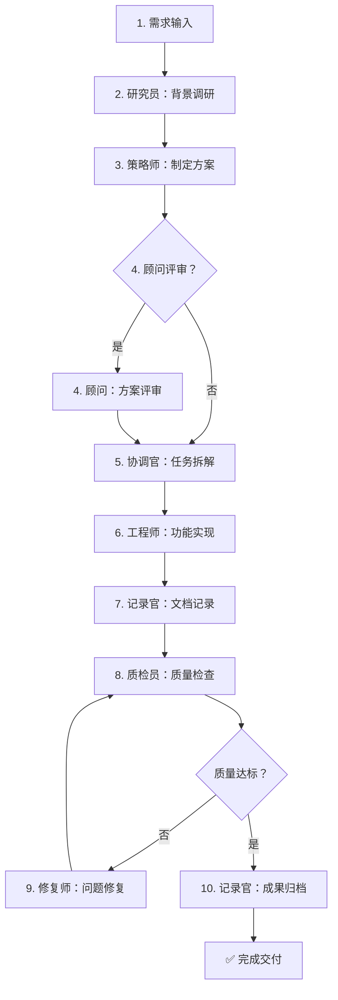

# ZhiLinClaw 完整架构文档

> 基于 OpenClaw + IronClaw + Hanwudi 三大理念的企业级 AI Agent 框架

---

## 📋 目录

- [架构总览](#架构总览)
- [核心模块详解](#核心模块详解)
- [快速开始](#快速开始)
- [使用示例](#使用示例)
- [最佳实践](#最佳实践)

---

## 架构总览

ZhiLinClaw采用**三层叠加架构**，融合了三个优秀设计理念：

```
┌────────────────────────────────────────────────────────────┐
│                    ZhiLinClaw 架构                         │
├────────────────────────────────────────────────────────────┤
│                                                            │
│  ┌──────────────────────────────────────────────────────┐ │
│  │           应用层：汉武帝 AI Agent 团队                 │ │
│  │  (Code = SOP - 标准化作业流程具象化为协作规则)        │ │
│  │                                                        │ │
│  │  ┌───────────┬────────────┬────────────┐             │ │
│  │  │ 决策层    │ 执行层     │ 监督层     │             │ │
│  │  │ • 策略师  │ • 工程师   │ • 质检员   │             │ │
│  │  │ • 研究员  │ • 协调官   │ • 修复师   │             │ │
│  │  │ • 顾问    │ • 记录官   │            │             │ │
│  │  └───────────┴────────────┴────────────┘             │ │
│  │                                                        │ │
│  │  核心组件：HanwudiWorkflow (SOP 工作流引擎)            │ │
│  └──────────────────────────────────────────────────────┘ │
│                          ↓                                 │
│  ┌──────────────────────────────────────────────────────┐ │
│  │         安全层：IronClaw 安全增强                     │ │
│  │  (深度防御 - 多层安全保障机制)                        │ │
│  │                                                        │ │
│  │  • WASM 沙箱隔离      • 加密凭证保险柜                │ │
│  │  • 多层安全过滤       • OAuth 认证网关                │ │
│  │                                                        │ │
│  │  核心组件：SecurityFilter, CredentialVault,           │ │
│  │               SandboxedExecutor, OAuthGateway         │ │
│  └──────────────────────────────────────────────────────┘ │
│                          ↓                                 │
│  ┌──────────────────────────────────────────────────────┐ │
│  │         核心层：OpenClaw 基础架构                     │ │
│  │  (本地优先 - 模块化、插件化、事件驱动)                │ │
│  │                                                        │ │
│  │  • 核心内核 (Core)      • 事件总线 (Events)           │ │
│  │  • 插件管理 (Plugins)   • 记忆管理 (Memory)           │ │
│  │  • 技能注册 (Skills)    • 接口适配 (Adapters)         │ │
│  │                                                        │ │
│  │  核心组件：ZhiLinClawCore, EventBus,                  │ │
│  │               PluginManager, MemoryManager            │ │
│  └──────────────────────────────────────────────────────┘ │
│                                                            │
└────────────────────────────────────────────────────────────┘
```

### 架构特点对比

| 特性 | OpenClaw | IronClaw | Hanwudi | ZhiLinClaw (融合) |
|------|----------|----------|---------|-------------------|
| **本地优先** | ✅ | ✅ | ❌ | ✅ |
| **模块化** | ✅ | ✅ | ❌ | ✅ |
| **插件化** | ✅ | ✅ | ❌ | ✅ |
| **WASM 沙箱** | ❌ | ✅ | ❌ | ✅ |
| **凭证加密** | ❌ | ✅ | ❌ | ✅ |
| **安全过滤** | 基础 | 高级 | ❌ | 高级 |
| **OAuth** | ❌ | ✅ | ❌ | ✅ |
| **Agent 团队** | ❌ | ❌ | ✅ | ✅ |
| **SOP 工作流** | ❌ | ❌ | ✅ | ✅ |
| **多层质检** | ❌ | ❌ | ✅ | ✅ |

---

## 核心模块详解

### 1️⃣ 应用层：汉武帝 AI Agent 团队

#### 核心理念
**Code = SOP(Team)** - 将标准化作业流程具象化为 Agent 团队的协作规则

#### 组织架构图
```
                    ┌─────────────┐
                    │  需求输入   │
                    └──────┬──────┘
                           │
                    ┌──────▼──────┐
                    │  决策层     │
                    │  (规划)     │
                    └──┬────┬────┘
                       │    │
          ┌────────────┘    └────────────┐
          │                              │
    ┌─────▼─────┐                 ┌─────▼─────┐
    │ 策略师    │                 │ 研究员    │
    │ Strategist│                 │ Researcher│
    └─────┬─────┘                 └─────┬─────┘
          │                              │
          └────────────┬─────────────────┘
                       │
                ┌──────▼──────┐
                │   顾问      │
                │  Advisor    │
                └──────┬──────┘
                       │
                ┌──────▼──────┐
                │  执行层     │
                │  (落地)     │
                └──┬────┬────┘
                   │    │
        ┌──────────┼────┼──────────┐
        │          │    │          │
  ┌─────▼─────┐ ┌─▼────┴─┐ ┌─────▼─────┐
  │ 工程师    │ │ 协调官 │ │ 记录官    │
  │ Engineer  │ │Coord.  │ │ Recorder  │
  └─────┬─────┘ └────────┘ └─────┬─────┘
        │                        │
        └────────────┬───────────┘
                     │
              ┌──────▼──────┐
              │  监督层     │
              │  (质检)     │
              └──┬────┬────┘
                 │    │
          ┌──────┘    └──────┐
          │                  │
    ┌─────▼─────┐      ┌─────▼─────┐
    │ 质检员    │      │ 修复师    │
    │ Inspector │      │ Fixer     │
    └───────────┘      └───────────┘
```

#### 标准协作流程 (SOP)



#### 文件列表
- [`src/agents/AgentBase.ets`](src/agents/AgentBase.ets) - Agent 基类
- [`src/agents/Strategist.ets`](src/agents/Strategist.ets) - 策略师
- [`src/agents/Researcher.ets`](src/agents/Researcher.ets) - 研究员
- [`src/agents/Advisor.ets`](src/agents/Advisor.ets) - 顾问
- [`src/agents/Engineer.ets`](src/agents/Engineer.ets) - 工程师
- [`src/agents/Coordinator.ets`](src/agents/Coordinator.ets) - 协调官
- [`src/agents/Recorder.ets`](src/agents/Recorder.ets) - 记录官
- [`src/agents/Inspector.ets`](src/agents/Inspector.ets) - 质检员
- [`src/agents/Fixer.ets`](src/agents/Fixer.ets) - 修复师
- [`src/agents/HanwudiWorkflow.ets`](src/agents/HanwudiWorkflow.ets) - SOP 工作流引擎

---

### 2️⃣ 安全层：IronClaw 安全增强

#### 核心理念
**深度防御** - 多层安全检查机制，确保系统安全

#### 安全架构
```
┌─────────────────────────────────────────┐
│         用户输入                        │
└──────────────┬──────────────────────────┘
               │
┌──────────────▼──────────────────────────┐
│ 第一层：安全过滤器                      │
│  • 提示词注入检测                       │
│  • XSS 攻击防护                         │
│  • 命令注入阻止                         │
│  • 敏感信息脱敏                         │
└──────────────┬──────────────────────────┘
               │
┌──────────────▼──────────────────────────┐
│ 第二层：沙箱执行                        │
│  • WASM 隔离环境                        │
│  • 资源访问限制                         │
│  • 超时控制                             │
│  • 审计日志                             │
└──────────────┬──────────────────────────┘
               │
┌──────────────▼──────────────────────────┐
│ 第三层：凭证保护                        │
│  • AES-256 加密存储                     │
│  • 运行时动态注入                       │
│  • 访问控制策略                         │
│  • 自动轮换机制                         │
└──────────────┬──────────────────────────┘
               │
┌──────────────▼──────────────────────────┐
│ 第四层：OAuth 认证                      │
│  • OAuth 2.0 流程                       │
│  • 令牌安全管理                         │
│  • 多提供商支持                         │
│  • 自动刷新                             │
└──────────────┬──────────────────────────┘
               │
┌──────────────▼──────────────────────────┐
│         安全输出                        │
└─────────────────────────────────────────┘
```

#### 文件列表
- [`src/security/SecurityContext.ets`](src/security/SecurityContext.ets) - 安全上下文
- [`src/security/CredentialVault.ets`](src/security/CredentialVault.ets) - 加密保险柜
- [`src/security/SecurityFilter.ets`](src/security/SecurityFilter.ets) - 安全过滤器
- [`src/security/SandboxedExecutor.ets`](src/security/SandboxedExecutor.ets) - 沙箱执行器
- [`src/security/OAuthGateway.ets`](src/security/OAuthGateway.ets) - OAuth 网关

---

### 3️⃣ 核心层：OpenClaw 基础架构

#### 核心理念
**本地优先** - 所有数据存储在本地，保护用户隐私

#### 模块关系
```
┌─────────────────────────────────────────────────┐
│              ZhiLinClawCore                     │
│            (核心系统协调器)                     │
└──┬────────────────────────────────────────────┬─┘
   │                                            │
   │  ┌──────────────┐    ┌──────────────┐     │
   └─▶│ Event Bus    │◀───│  Plugins     │     │
      │ (事件总线)   │    │ (插件管理)   │     │
      └──────┬───────┘    └──────────────┘     │
             │                                  │
      ┌──────┴───────┐    ┌──────────────┐     │
      │              │    │   Memory     │     │
      │   Skills     │    │  (记忆管理)  │     │
      │ (技能注册)   │    └──────────────┘     │
      └──────────────┘                          │
                                                 │
      ┌────────────────────────────────┐        │
      │       Adapters                 │◀───────┘
      │  • AI Model (本地/云端)        │
      │  • Storage (Preferences/RDB)   │
      └────────────────────────────────┘
```

#### 文件列表
- [`src/core/ZhiLinClawCore.ets`](src/core/ZhiLinClawCore.ets) - 核心系统
- [`src/events/EventBus.ets`](src/events/EventBus.ets) - 事件总线
- [`src/plugins/PluginManager.ets`](src/plugins/PluginManager.ets) - 插件管理
- [`src/memory/MemoryManager.ets`](src/memory/MemoryManager.ets) - 记忆管理
- [`src/skills/SkillRegistry.ets`](src/skills/SkillRegistry.ets) - 技能注册
- [`src/adapters/AIModelAdapter.ets`](src/adapters/AIModelAdapter.ets) - AI 模型适配
- [`src/adapters/StorageAdapter.ets`](src/adapters/StorageAdapter.ets) - 存储适配

---

## 快速开始

### 环境要求

- OpenHarmony SDK 5.0+
- ArkTS 编译器
- DevEco Studio（推荐）

### 安装依赖

```bash
npm install
```

### 构建项目

```bash
npm run build
```

### 运行示例

```bash
# 运行主程序
npm run start

# 运行安全功能演示
npm run demo:security

# 运行汉武帝架构演示
npm run demo:hanwudi
```

---

## 使用示例

### 示例 1: 使用完整工作流（推荐）

```typescript
import { HanwudiWorkflow } from './src/agents';

// 1. 创建工作流实例
const workflow = new HanwudiWorkflow({
  enableResearcher: true,        // 启用研究员
  enableAdvisorReview: true,     // 启用顾问评审
  enableFullDocumentation: true, // 启用完整文档
  qualityThreshold: 75,          // 质量阈值 75 分
  maxIterations: 3,              // 最多迭代 3 次
  enableLogging: true            // 启用日志
});

// 2. 定义需求
const requirement = `
  开发一个天气查询应用，需要满足以下要求：
  1. 支持查询全国主要城市的实时天气
  2. 显示温度、湿度、风速、空气质量等数据
  3. 提供未来 7 天天气预报
  4. 界面简洁美观，支持深色模式
  5. 响应速度快，加载时间小于 2 秒
`;

// 3. 执行完整工作流
const result = await workflow.execute(requirement);

// 4. 查看结果
console.log(`✅ 成功：${result.success}`);
console.log(`📈 质量评分：${result.qualityReport?.overallScore}/100`);
console.log(`⏱️  执行时间：${(result.executionTime / 1000).toFixed(2)}秒`);
console.log(`📄 生成文档：${Object.keys(result.documents).length}个`);
```

### 示例 2: 单独使用特定 Agent

```typescript
import { Strategist, Researcher, Engineer, Inspector } from './src/agents';

// 策略师 - 制定计划
const strategist = new Strategist();
const plan = await strategist.process('如何开发一个电商网站？');
console.log('📋 执行策略:', plan.documents.strategy);

// 研究员 - 行业调研
const researcher = new Researcher();
const report = await researcher.process('AI Agent 技术的发展趋势');
console.log('📚 调研报告:', report.documents.researchReport);

// 工程师 - 编写代码
const engineer = new Engineer();
const code = await engineer.process('实现一个快速排序算法');
console.log('💻 生成的代码:', code.documents.code);

// 质检员 - 代码审查
const inspector = new Inspector();
const review = await inspector.process(JSON.stringify(code.documents));
console.log('🔍 质量评分:', review.documents.qualityReport.overallScore);
```

### 示例 3: 场景化配置

#### 小型代码开发（简化流程）
```typescript
const workflow = new HanwudiWorkflow({
  enableResearcher: false,       // 不需要调研
  enableAdvisorReview: false,    // 跳过评审
  enableFullDocumentation: false,// 简化文档
  qualityThreshold: 60,          // 降低质量阈值
  maxIterations: 1               // 单次执行
});

const result = await workflow.execute('编写一个日期格式化工具函数');
```

#### 复杂项目落地（完整流程）
```typescript
const workflow = new HanwudiWorkflow({
  enableResearcher: true,
  enableAdvisorReview: true,
  enableFullDocumentation: true,
  qualityThreshold: 80,          // 高质量要求
  maxIterations: 5,              // 允许多次迭代
  enableLogging: true
});

const result = await workflow.execute('开发企业级 CRM 系统');
```

#### 行业调研报告（只需部分角色）
```typescript
import { Researcher, Advisor, Recorder } from './src/agents';

const researcher = new Researcher();
const advisor = new Advisor();
const recorder = new Recorder();

// 1. 调研
const research = await researcher.process('2026 年人工智能发展趋势');

// 2. 评审
const review = await advisor.process(JSON.stringify(research.documents));

// 3. 归档
const doc = await recorder.process('整理调研报告');
```

### 示例 4: 与安全模块集成

```typescript
import { SecurityFilter, SandboxedExecutor } from './src/security';
import { Engineer } from './src/agents';

const securityFilter = new SecurityFilter();
const sandbox = new SandboxedExecutor();
const engineer = new Engineer();

// 1. 工程师生成代码
const codeResult = await engineer.process('编写工具函数');

// 2. 安全检查
const safetyCheck = await securityFilter.checkInput(codeResult.output);

if (safetyCheck.passed) {
  console.log('✅ 安全检查通过');
  
  // 3. 在沙箱中执行
  const execResult = await sandbox.execute(codeResult.output);
  console.log('🚀 执行结果:', execResult.output);
} else {
  console.log('❌ 安全检查未通过');
  console.log('⚠️  发现问题:', safetyCheck.issues);
}
```

### 示例 5: 凭证安全管理

```typescript
import { CredentialVault, CredentialType, OAuthGateway } from './src/security';

// 1. 创建加密保险柜
const encryptionKey = generateSecureKey(); // 32 字节密钥
const vault = new CredentialVault(encryptionKey);

// 2. 存储 API 密钥
const apiKeyId = await vault.store(
  'openai_api_key',
  CredentialType.API_KEY,
  'sk-xxxxxxxxxxxxxxxx',
  {
    tags: ['openai', 'production'],
    accessPolicy: {
      allowedExecutors: ['ai_service'],
      requireVerification: false
    }
  }
);

// 3. 使用凭证
const apiKey = await vault.get(apiKeyId, 'ai_service');

// 4. OAuth 认证
const oauth = new OAuthGateway(vault);
oauth.registerProvider({
  id: 'github',
  name: 'GitHub',
  authorizationUrl: 'https://github.com/login/oauth/authorize',
  tokenUrl: 'https://github.com/login/oauth/access_token',
  clientId: 'your_client_id',
  clientSecretCredentialId: apiKeyId,
  redirectUri: 'http://localhost:3000/callback',
  scopes: ['user:email']
});

const authUrl = oauth.getAuthorizationUrl('github');
```

---

## 最佳实践

### 1. 选择合适的流程复杂度

| 项目规模 | 推荐配置 | 激活角色 |
|----------|----------|----------|
| **小型** (< 1 天) | 简化流程 | 工程师 + 质检员 |
| **中型** (1-5 天) | 标准流程 | 策略师 + 工程师 + 质检员 + 记录官 |
| **大型** (> 5 天) | 完整流程 | 全角色 |

### 2. 质量阈值设置建议

```typescript
// 内部工具：60 分即可
new HanwudiWorkflow({ qualityThreshold: 60 })

// 客户项目：建议 75 分
new HanwudiWorkflow({ qualityThreshold: 75 })

// 核心产品：建议 85 分以上
new HanwudiWorkflow({ qualityThreshold: 85 })
```

### 3. 安全优先级

```typescript
// 任何时候都启用安全过滤
const filter = new SecurityFilter({
  enablePromptInjectionDetection: true, // 必须启用
  enableXSSDetection: true,             // 必须启用
  riskThreshold: RiskLevel.HIGH         // 高风险阻止
});

// 涉及外部 API 调用时使用沙箱
const sandbox = new SandboxedExecutor({
  allowNetwork: true,                   // 仅允许白名单域名
  allowedHosts: ['api.example.com'],    // 白名单
  timeout: 5000                         // 超时控制
});
```

### 4. 文档管理

```typescript
// 记录官自动归档
const recorder = new Recorder();

// 创建归档包
const archive = recorder.createArchive(
  '项目 v1.0 交付物',
  ['doc_1', 'doc_2', 'doc_3'], // 文档 ID 列表
  '完整的项目交付文档'
);

// 导出为 Markdown
const md = recorder.exportToMarkdown('doc_1');
```

---

## 参考资料

- [OpenClaw GitHub](https://github.com/openclaw)
- [IronClaw GitHub](https://github.com/nearai/ironclaw)
- [MetaGPT GitHub](https://github.com/geekan/MetaGPT)
- [汉武帝架构文档](docs/HANWUDI_ARCHITECTURE.md)

---

## 许可证

Apache-2.0 License

---

🤖 Generated with ZhiLinClaw + Hanwudi Architecture
